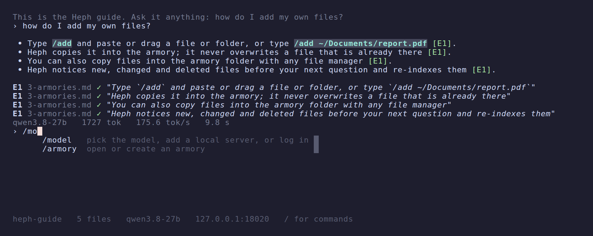

# Heph

Heph answers questions from the files in a folder and checks every quote it cites against
the source. An **armory** is any folder you run `heph init` in; Heph keeps its state in
`.harness/` inside it. Heph is a plain command line that talks to your local model.

<p align="center">
  
</p>

## Install

Choose one path. Heph needs Python 3.14 and clang 14+ (it compiles its core once).

### From source (recommended)

Install [uv](https://docs.astral.sh/uv/):

```bash
curl -LsSf https://astral.sh/uv/install.sh | sh
```

Then Heph:

```bash
git clone https://github.com/gildrb/heph-agent
cd heph-agent
uv sync
uv run heph
```

### Homebrew

```bash
brew install gildrb/heph/heph
```

To update a source checkout:

```sh
git pull
uv sync
uv run heph
```

## Use an armory

Run `heph` anywhere. Outside an armory it opens the Heph guide, an armory of pages about
Heph: ask it "how do I add my own files?" and the answer cites the guide.

```sh
cd ~/Documents/contracts    # any folder of files
heph init                   # make it an armory
heph                        # ask questions
```

| Command | Does |
| --- | --- |
| `heph` | opens the armory in this folder, or the Heph guide |
| `heph init [name]` | makes this folder an armory, or creates `~/.armories/[name]` |
| `/model` | picks a model from every login, adds a local server, or logs in |
| `/armory`, `/add` | picks, creates or switches armories; copies files in |
| `heph ask [armory] "question" --json` | one answer, for scripts |

Type `/` for the command menu. Commands are forgiving: `/mod`, `/mdl` and `/modle` all run
`/model`. Pickers filter as you type; arrows move, Enter picks, Esc skips. New, changed and
deleted files are re-indexed before the next question.

Answers cite evidence as `[E1: "quoted words"]`, and Heph checks each quote against that
passage: ✓ found, ✗ not found or unknown passage, ? no quote.

With no login, Heph uses a server at `http://127.0.0.1:8080/v1` (llama.cpp
`llama-server`). `/model http://host:port/v1` adds any other local server (vLLM, SGLang,
Ollama); `/login` adds OpenAI, OpenRouter, DeepSeek, Z.AI or your ChatGPT subscription.
See [Configuration](docs/configuration.md).

## Compared to v0.0.63

| | v0.0.63 | Now | Proof |
| --- | --- | --- | --- |
| A ✓ citation means | the cited passage was retrieved | the quoted words are in it | [`cite_sound`](core/LAWS.bend), proven in CI |
| Model calls per question | 2 to 27 | 1 | [`answer.py`](src/heph/answer.py) |
| Default model | none until you pick one | your local server, no key | [Configuration](docs/configuration.md) |
| Model tools | files and web; shell and plugins if trusted | none | [Architecture](docs/architecture.md#zero-remote-code-execution) |
| Downloads at run time | llama.cpp builds, models, model lists | nothing | same |
| Install (Linux, empty venv) | 42 packages, 46 MiB | 10 packages, 19 MiB | `uv sync` / `uv pip install` |
| Heph's own code | 1.76 MB Python | 110 KB Python + 46 KB Bend | [`src/heph`](src/heph), [`core`](core) |
| Armory | files go in `materials/` | any folder | [Armories](docs/armories.md) |
| Interface | full-screen TUI | full-screen command line | screenshot above |

## Design

Python (`src/heph`) reads files, talks to the model and prints answers. A Bend core
(`core/`) chunks documents, ranks passages with BM25 and checks quotes. Nine laws in
`core/LAWS.bend`, such as "a quote marked ✓ is byte-for-byte in its passage", are proven by
`bend core/PROOF.bend` in CI. The model has no tools, Heph talks only to the model you
picked, and nothing is downloaded. See [Architecture](docs/architecture.md).

## Development

```sh
uv sync --group dev
uv run ruff check
uv run ty check
uv run vulture
```

See `CONTRIBUTING.md` and `SECURITY.md` for project policy.
